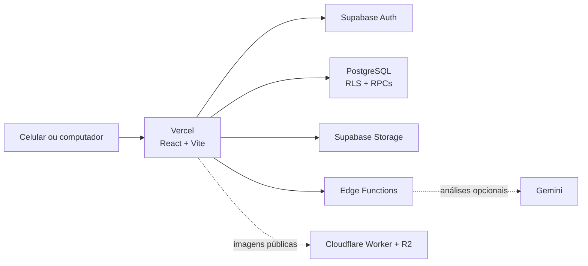

<div align="center">
  

  # Sistema EJC Capelinha

  Plataforma web para organizar o Encontro de Jovens com Cristo de Capelinha,
  desde a inscrição e montagem das equipes até a operação do encontro,
  o pós-encontro e a prestação de contas.

  [](https://github.com/adelmojsantos/sistema-ejc/actions/workflows/quality.yml)
  [](https://react.dev/)
  [](https://www.typescriptlang.org/)
  [](https://supabase.com/)

  **[Acessar o sistema](https://ejc-capelinha.vercel.app)**
</div>

---

## Sobre o projeto

O Sistema EJC Capelinha centraliza processos que antes dependiam de planilhas,
formulários e controles separados. A aplicação atende dirigentes, secretaria,
coordenadores e equipes operacionais com permissões específicas por função e por
encontro.

O projeto está em produção, possui interface responsiva para uso em celulares e
mantém validações automatizadas de frontend, jornadas públicas, banco de dados e
regras de autorização.

## Principais módulos

| Área | Recursos |
| --- | --- |
| Acesso | Login, primeiro acesso, cadastro e recuperação de senha por e-mail |
| Administração | Usuários, grupos, permissões, auditoria e troca de Dirigência |
| Secretaria | Pessoas, participantes, inscrições, lista de espera e confirmações |
| Encontros | Edições, equipes, círculos, cronograma, montagem e configurações |
| Coordenação | Minha equipe, avaliações, taxas e informações operacionais |
| Visitação | Duplas, distribuição, acompanhamento, presenças e pagamentos |
| Compras | Taxas, camisetas, configurações e consolidações |
| Almoxarifado | Itens, saldos, movimentações, pedidos e listas de compras |
| Financeiro | Livro-caixa, categorias, comprovantes e integração com compras |
| Atividades | Recepção, recreação infantil, cozinha, cuidados e ligação |
| Pós-encontro | Círculos, fichas de acompanhamento e pesquisas |
| Conteúdo e relatórios | Biblioteca, etiquetas, crachás, placas e exportações |
| Diagnósticos | Erros técnicos acessíveis apenas a usuários desenvolvedores |

Algumas análises de avaliações podem utilizar IA generativa quando a Edge Function
e seus segredos estiverem configurados. Os fluxos administrativos essenciais não
dependem desse recurso.

## Arquitetura



- **Frontend:** React 19, TypeScript, React Router e CSS responsivo.
- **Backend:** Supabase Auth, PostgreSQL, Row Level Security, RPCs e Edge
  Functions.
- **Arquivos:** Supabase Storage para conteúdo protegido e integração auxiliar com
  Cloudflare R2 para imagens públicas.
- **Hospedagem:** Vercel, com fallback de rotas para a SPA.
- **Qualidade:** Vitest, Testing Library, Playwright, pgTAP e GitHub Actions.

As páginas são carregadas sob demanda. A autorização é verificada no frontend para
orientar a navegação e novamente no banco, por RLS ou funções protegidas, para
garantir a segurança efetiva.

## Requisitos

- [Node.js 22](https://nodejs.org/)
- [pnpm 10](https://pnpm.io/)
- Projeto Supabase para executar a aplicação
- Git

Docker não é necessário para desenvolver o frontend. Ele é exigido apenas para
subir a stack completa do Supabase localmente; os testes de banco também são
executados automaticamente em um runner isolado do GitHub Actions.

## Configuração local

1. Clone o repositório:

   ```bash
   git clone https://github.com/adelmojsantos/sistema-ejc.git
   cd sistema-ejc
   ```

2. Instale as dependências:

   ```bash
   pnpm install
   ```

3. Crie um arquivo `.env.local`:

   ```env
   VITE_SUPABASE_URL=https://seu-projeto.supabase.co
   VITE_SUPABASE_KEY=sua-chave-publica-anon-ou-publishable
   ```

4. Inicie o ambiente:

   ```bash
   pnpm dev
   ```

5. Abra `http://localhost:5173`.

O arquivo `.env.local` é ignorado pelo Git. A chave usada pelo frontend deve ser a
chave pública `anon`/`publishable`; nunca use `service_role` em uma variável
iniciada por `VITE_`.

## Variáveis de ambiente

### Frontend

| Variável | Obrigatória | Finalidade |
| --- | --- | --- |
| `VITE_SUPABASE_URL` | Sim | URL pública do projeto Supabase |
| `VITE_SUPABASE_KEY` | Sim | Chave pública `anon` ou `publishable` |
| `VITE_ENABLE_REMOTE_ERROR_LOGS` | Não | Ativa o envio controlado de erros para Diagnósticos |
| `VITE_PUBLIC_IMAGE_BASE_URL` | Não | Base pública das imagens servidas pelo Worker/R2 |

### Edge Functions e operações administrativas

Estas variáveis são segredos de servidor. Configure-as no ambiente apropriado do
Supabase ou do processo administrativo; não as exponha no frontend:

| Variável | Uso |
| --- | --- |
| `SUPABASE_URL` | URL usada por Edge Functions e scripts |
| `SUPABASE_ANON_KEY` | Chamadas públicas originadas em Edge Functions |
| `SUPABASE_SERVICE_ROLE_KEY` | Operações administrativas protegidas |
| `PUBLIC_APP_URL` | Endereço usado em convites e redirecionamentos |
| `GEMINI_API_KEY` | Análises opcionais com IA |
| `GEMINI_MODEL` | Modelo utilizado nas análises |

## Comandos

| Comando | Descrição |
| --- | --- |
| `pnpm dev` | Inicia o Vite em modo de desenvolvimento |
| `pnpm run build` | Verifica tipos e gera o build de produção |
| `pnpm preview` | Serve localmente o build gerado |
| `pnpm lint` | Executa o ESLint |
| `pnpm test` | Executa os testes unitários |
| `pnpm test:watch` | Mantém os testes unitários em observação |
| `pnpm test:coverage` | Gera o relatório de cobertura |
| `pnpm test:e2e` | Executa Playwright em viewport móvel e desktop |
| `pnpm worker:check` | Valida o Worker de imagens sem publicar |
| `pnpm worker:deploy` | Publica o Worker de imagens |

Os scripts de migração de imagens e comprovantes em `scripts/` são operações
administrativas. Eles exigem credenciais privilegiadas e não devem ser executados
como parte da inicialização comum do projeto.

## Banco de dados e migrations

O banco é versionado em `supabase/migrations`. Cada arquivo deve ter uma versão
única com 14 dígitos:

```text
YYYYMMDDHHMMSS_descricao_da_mudanca.sql
```

Fluxo recomendado:

```bash
# conferir o que seria aplicado
pnpm dlx supabase@2.110.0 db push --linked --dry-run

# aplicar somente depois da revisão do dry-run
pnpm dlx supabase@2.110.0 db push --linked
```

Regras importantes:

- não editar uma migration já aplicada;
- corrigir o banco com uma nova migration;
- manter SQL idempotente quando aplicável;
- conferir o `dry-run` antes de alterar o projeto vinculado;
- validar RLS, permissões e efeitos colaterais com testes transacionais;
- não executar fixtures de teste em produção.

O histórico legado foi normalizado e está alinhado com o projeto remoto. Consulte
[as regras completas de migrations](./supabase/MIGRATIONS.md) antes de qualquer
mudança estrutural.

## Testes e integração contínua

A workflow [Qualidade](./.github/workflows/quality.yml) roda em pushes para
`master` e em pull requests.

### Frontend

- ESLint;
- testes unitários com Vitest e Testing Library;
- verificação TypeScript e build de produção;
- jornadas Playwright em Chromium móvel e desktop.

### Banco e autorização

- prepara a compatibilidade do esquema legado apenas dentro da CI;
- reconstrói o banco a partir das migrations;
- executa pgTAP dentro de transações com `ROLLBACK`;
- cobre RLS, matriz de perfis, Diagnósticos, troca de Dirigência e a integração
  Almoxarifado–Financeiro.

Para rodar as verificações disponíveis sem a stack local do Supabase:

```bash
pnpm lint
pnpm test
pnpm run build
pnpm test:e2e
```

## Segurança e privacidade

- Autenticação e sessões gerenciadas pelo Supabase Auth.
- Autorização baseada em grupos, permissões e vínculos por encontro.
- RLS habilitada nas tabelas protegidas.
- Operações públicas sensíveis passam por RPCs validadas.
- Funções administrativas usam credenciais privilegiadas apenas no servidor.
- Primeiro acesso e recuperação de senha usam links temporários por e-mail.
- Diagnósticos são restritos ao grupo de Desenvolvedores.
- Logs evitam armazenar senhas, tokens e conteúdo sensível desnecessário.
- A aplicação inclui uma Política de Privacidade acessível publicamente.

Nunca envie tokens, senhas, chaves privadas, comprovantes ou dados pessoais reais
em issues, logs de CI ou fixtures de teste.

## Estrutura do repositório

```text
.
├── .github/workflows/   # Integração contínua
├── cloudflare/          # Worker e configuração de imagens públicas
├── docs/                # Guias funcionais e operacionais
├── e2e/                 # Jornadas Playwright
├── public/              # Arquivos públicos
├── scripts/             # Utilitários administrativos e preparação da CI
├── src/
│   ├── components/      # Componentes reutilizáveis
│   ├── contexts/        # Estado global e providers
│   ├── hooks/           # Hooks da aplicação
│   ├── pages/           # Páginas organizadas por domínio
│   ├── services/        # Acesso a dados e integrações
│   ├── types/           # Tipos TypeScript
│   └── utils/           # Regras e utilitários compartilhados
└── supabase/
    ├── functions/       # Edge Functions
    ├── migrations/      # Evolução versionada do banco
    └── tests/           # Testes SQL transacionais
```

## Publicação

Antes de publicar:

1. confirme que a CI está aprovada;
2. revise as migrations pendentes com `db push --linked --dry-run`;
3. verifique as variáveis do ambiente de produção;
4. publique o frontend;
5. execute o roteiro de smoke test nas rotas afetadas;
6. acompanhe Diagnósticos após a liberação.

Mudanças de banco e frontend devem permanecer compatíveis durante a janela de
publicação. Para incidentes, siga o
[guia de recuperação operacional](./docs/recuperacao-operacional.md).

## Documentação

- [Homologação e resiliência operacional](./docs/p4-homologacao-resiliencia.md)
- [Recuperação operacional](./docs/recuperacao-operacional.md)
- [Almoxarifado — histórico da Fase 3](./docs/almoxarifado-fase-3-andamento.md)
- [Módulo de Compras](./docs/modulo-compras.md)
- [Avaliações com IA](./docs/relatorio-avaliacao-ia.md)
- [Otimização de egress e cache](./docs/supabase-cached-egress.md)
- [Política de migrations](./supabase/MIGRATIONS.md)

## Colaboração

1. Crie uma branch curta e descritiva.
2. Faça mudanças pequenas e focadas.
3. Adicione testes para correções e novas regras.
4. Não inclua credenciais ou dados pessoais.
5. Abra um pull request e aguarde a workflow `Qualidade`.
6. Publique somente após revisão e CI aprovada.

---

<div align="center">
  Desenvolvido para apoiar a missão e a organização do <strong>EJC Capelinha</strong>.
</div>
